# 🌱 Shivam Mishra — AI Developer Portfolio (v2)

A premium, dynamic, and full-stack personal portfolio application built with a lightweight and fast Node.js + Express backend, SQLite database, and vanilla HTML/CSS/JS frontend featuring a high-fidelity glassmorphism design, custom particle mesh backgrounds, custom cursor effects, and a secure CRUD Admin Console.

---

## 📁 Project Structure

```
portfolio-v2/
├── server.js              ← Express backend, SQLite setup, API endpoints, session auth
├── package.json           ← Dependencies (Express, better-sqlite3, bcryptjs, multer)
├── package-lock.json      
├── .gitignore             ← Prevents committing DB, node_modules, and user uploads
├── portfolio.db           ← SQLite database (automatically created and seeded on start)
├── update_projects.js     ← Dev utility script to seed/update main showcase projects
├── views/                 
│   ├── login.html         ← Secure Admin Panel Login page
│   └── admin.html         ← CRUD Dashboard with 13 custom tabs
└── public/                ← Static public files
    ├── index.html         ← Portfolio homepage containing all dynamically-loaded sections
    ├── style.css          ← Custom CSS (palette, responsive, glassmorphism, scrollbars)
    ├── script.js          ← Frontend JS (cursors, particle canvas, dynamic APIs, scroll reveal)
    ├── groot_logo.png     
    ├── profile.jpeg       
    └── uploads/           ← Stores uploaded project cover images, certificates, and resumes
```

---

## 🚀 Setup & Run

### 1. Requirements
Ensure you have **Node.js** (v18+) installed.

### 2. Install Dependencies
Navigate to the root directory and run:
```bash
npm install
```

### 3. Running the Application
- **Production Mode**:
  ```bash
  npm start
  ```
- **Development Mode** (with hot-reloading via nodemon):
  ```bash
  npm run dev
  ```

### 4. Ports & Access
Once started, the application is accessible at:
- **Public Portfolio** → `http://localhost:3000`
- **Admin Panel** → `http://localhost:3000/admin` (redirects to `/login` if not authenticated)

---

## 🔐 Login Credentials

The database automatically seeds a default admin user on first startup if no admin exists.

> ⚠️ **Important Security Note**: For security reasons, actual default credentials should not be published in public documentation. You can find the initial default credentials seeded within the database setup logic inside `server.js` (lines 143-150), use them for your first login, and **immediately change them** using the **Settings** tab in the Admin Console.

---

## 🗄️ Database Schema

The SQLite database (`portfolio.db`) uses `better-sqlite3` and defines the following **12 tables**:

```mermaid
erDiagram
    projects {
        int id PK
        text title
        text description
        text full_desc
        text emoji
        text image_url
        text tags
        text github_url
        text linkedin_url
        text team
        text gradient
        int is_pinned
        text gallery_urls
        datetime created_at
    }
    certificates {
        int id PK
        text title
        text issuer
        text date
        text image_url
        text credential_url
        int sort_order
        datetime created_at
    }
    activities {
        int id PK
        text title
        text description
        text image_urls
        text certificates
        text date
        text category
        int sort_order
        datetime created_at
    }
    upcoming_projects {
        int id PK
        text title
        text description
        text expected_date
        text status
        text tech_stack
        int sort_order
        datetime created_at
    }
    partners {
        int id PK
        text name
        text role
        text image_url
        text link
        text bio
        int sort_order
        datetime created_at
    }
    messages {
        int id PK
        text name
        text email
        text message
        text ip
        int is_read
        datetime created_at
    }
    settings {
        text key PK
        text value
    }
    skills {
        int id PK
        text name
        int sort_order
        datetime created_at
    }
    education {
        int id PK
        text icon
        text title
        text subtitle
        text institution
        text date_range
        text tags
        int sort_order
        datetime created_at
    }
    blogs {
        int id PK
        text title
        text description
        text link
        text platform
        int sort_order
        datetime created_at
    }
    socials {
        int id PK
        text name
        text url
        int sort_order
        datetime created_at
    }
```



### Table Definitions:

1. **`admin`**: Stores credentials for backend authentication.
2. **`projects`**: Primary portfolio projects with gradient configurations, pins, emojis, and detail fields.
3. **`certificates`**: Course certifications, issuer info, and verification URLs.
4. **`activities`**: Hackathons, coding contests, and extracurricular categories.
5. **`upcoming_projects`**: Expected pipeline tracking with status tags (`planning`, `in-progress`, `coming-soon`).
6. **`partners`**: Project collaborators, specialized roles, and profile URLs.
7. **`messages`**: Visitor queries sent via the contact form, including their IP address for security.
8. **`settings`**: Key-value metadata storage (e.g. stores the `resume_url` path dynamically).
9. **`skills`**: Custom technology tags shown in the Skills section.
10. **`education`**: Timelines, institutions, date ranges, and academic tags.
11. **`blogs`**: Articles dynamically fetched and grouped by publication platform.
12. **`socials`**: Links to social accounts mapped to SVG brand icons on the client interface.

---

## 🌐 Public REST API

The frontend interacts with the backend using the following public JSON endpoints:

| Endpoint | Method | Response Description |
|---|---|---|
| `/api/projects` | `GET` | Array of all projects (sorted by pinned state, then date). |
| `/api/projects/:id` | `GET` | Full single project metadata (for modal display). |
| `/api/skills` | `GET` | Array of skills (sorted by display order). |
| `/api/education` | `GET` | Array of background items (sorted by display order). |
| `/api/upcoming` | `GET` | Future roadmap projects (sorted by display order). |
| `/api/activities` | `GET` | Extracurricular items, hackathons, and images. |
| `/api/certificates` | `GET` | Listed certifications and badge image URLs. |
| `/api/partners` | `GET` | Collaborator profiles, roles, and links. |
| `/api/blogs` | `GET` | Dynamic technical articles. |
| `/api/socials` | `GET` | Social platform profiles and links. |
| `/api/resume` | `GET` | JSON containing the active resume PDF path. |
| `/api/messages` | `POST` | Submit a direct contact query from the visitor. |

---

## 🛠️ Secure Admin Dashboard API

All dashboard endpoints require the user to have an active session established via the `requireAuth` middleware. If authentication fails, the API responds with a redirect or JSON error.

### Project CRUD
- `GET /admin/api/projects` — Fetch all projects.
- `POST /admin/api/projects` — Create project with cover image and optional gallery (supports multi-part uploads via `multer`).
- `PUT /admin/api/projects/:id` — Update project metadata, changing pinned states and re-uploading images.
- `DELETE /admin/api/projects/:id` — Delete project and remove related uploads from disk.

### Additional CRUDs (Certificates, Activities, Partners, Upcoming, Skills, Education, Blogs, Socials)
Each has standard REST handlers matching the fields in the schema:
- `GET /admin/api/[section]` — List all records.
- `POST /admin/api/[section]` — Create new record (supports position reordering parameters `top`, `middle`, `bottom`, `custom`).
- `PUT /admin/api/[section]/:id` — Update existing record.
- `DELETE /admin/api/[section]/:id` — Remove record and clean up associated assets.

### Administrative Controls
- `GET /admin/api/messages` — Review all messages left by visitors.
- `PUT /admin/api/messages/:id/read` — Toggle a message's read status.
- `DELETE /admin/api/messages/:id` — Remove message.
- `POST /admin/api/resume` — Upload new resume PDF (updates `resume_url` in settings table).
- `POST /admin/api/change-username` — Securely update credentials.
- `POST /admin/api/change-password` — Securely update current password using bcrypt hashing verification.

---

## 🎨 User Interface & Styling Details

The interface relies on premium dark modes, harmony colors, and responsive design systems.

- **Theme Palette**: Deep Dark Blue (`#04080f`), Rich Glassmorphism (`rgba(255,255,255,0.055)`), Vibrant Pink (`#f72585`), Crimson (`#e63946`).
- **Typography**: Display Headers use `Syne`, tech badges and console logs use `Space Mono`.
- **Canvas Animations**: An interactive, dynamic particle net background is rendered using JavaScript `canvas2d` mapping node connections within 110px.
- **Scroll Reveal**: Uses standard `IntersectionObserver` configurations in `public/script.js` to animate grid items as they enter the screen viewport.
- **Mouse Tilt Micro-animations**: Moving the cursor over the showcase cards calculates relative cursor coordinates to dynamically tilt cards (`rotateX` / `rotateY`) and raise elevation.
- **Scrollability Support**: The admin panel sidebar and forms automatically adjust to use custom scrollbars on lower vertical heights to prevent navigation cutting.

---

## 📦 Push to Git / GitHub

To push your project to a remote GitHub repository:

```bash
# 1. Rename default branch
git branch -M main

# 2. Add remote URL
git remote add origin https://github.com/shivamishra12/Portfolio.git

# 3. Push code to the repository (overwrites placeholder files if force pushing)
git push -u origin main --force
```

The `.gitignore` configuration guarantees that the database file `portfolio.db` (containing user session details, messages, and your custom passwords) and the dependencies in `node_modules/` are not pushed to public repositories.

---

Built with 💙 by **Shivam Kumar**
